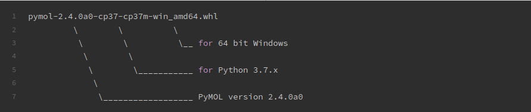

<!-- Uncomment this to create a PDF with pandoc and run:
pandoc INSTALACAO.md -o doc/guia-de-instalacao.pdf -V geometry:"top=1in, bottom=1in, left=1in, right=1in" --highlight-style="zenburn"
---
header-includes:
  - \hypersetup{colorlinks=true,
            allbordercolors={0 0 0},
            pdfborderstyle={/S/U/W 1}}
--- 
-->

PyMOL 2.4 Open Source para Windows
=====

Este repositório fornece um método para instalar o PyMOL v2.4 pelo [Anaconda](https://www.anaconda.com) no Windows.

# Instalação

Siga estas etapas para instalar o PyMOL v2.4:

## 1. Instale o Anaconda

Baixe o [Anaconda](https://www.anaconda.com/download) e instale-o.

## 2. Crie um ambiente no Anaconda

Abra o `Anaconda Prompt`, você pode abri-lo digitando `Anaconda Prompt` no barra de pesquisa, localizada no canto inferior esquerdo. Com o `Anaconda Prompt` aberto, execute:

```bash
conda create -n pymol python=3.7
```

Em seguida, ative o ambiente `pymol`:

```bash
conda activate pymol
```

## 3. Instale os pacotes de Python necessários

Ainda no `Anaconda Prompt`, execute:

- pip 3:
```bash
conda install -c anaconda pip
```

- Numpy:
```bash
pip install numpy
```

- PMW:
```bash
pip install pmw
```

- pyqt5:
```bash
pip install pyqt5
```

## 4. Baixe os arquivos _wheel_ do PyMOL 

Baixe os arquivos _wheel_ do PyMOL de código aberto pré-compilados, compatíveis com Python 3.7.x e Windows de 64 bits, nos links abaixo:

- [pymol-launcher](https://github.com/jvsguerra/pymol-2.4-win/releases/latest/download/pymol_launcher-2.1-cp37-cp37m-win_amd64.whl)

- [pymol](https://github.com/jvsguerra/pymol-2.4-win/releases/latest/download/pymol-2.4.0-cp37-cp37m-win_amd64.whl)

_Nota:_ Você pode verificar a versão do Python no anaconda digitando `python --version`.

Se você estiver usando uma versão diferente do Python ou do Windows de 32 bits, há outras versões pré-compiladas [aqui](https://www.lfd.uci.edu/~gohlke/pythonlibs/#pymol).

A estrutura do nome do arquivo é a seguinte:



## 5. Instale os arquivos _wheel_ do PyMOL

No ambiente `pymol` no Anaconda, mude para o diretório de downloads (`C:\Users\usuario\Downloads`):

```bash
cd Downloads
```

Em seguida, instale `pymol_launcher-2.1-cp37-cp37m-win_amd64.whl`, digitando:

```bash
pip install --no-index --find-links="%CD%" pymol_launcher-2.1-cp37-cp37m-win_amd64.whl
```

Finalmente, para instalar `pymol-2.4.0-cp37-cp37m-win_amd64.whl`, execute:

```bash
pip install --upgrade --no-deps pymol-2.4.0-cp37-cp37m-win_amd64.whl
```

_Nota_: Se você baixou arquivos diferentes no **Passo 4**, substitua `pymol_launcher-2.1-cp37-cp37m-win_amd64.whl` e `pymol-2.4.0-cp37-cp37m-win_amd64.whl` pelos arquivos _wheel_ baixados.

## 6. Inicie o PyMOL v2.4

No ambiente `pymol` no Anaconda, execute:

```bash
pymol
```

Então, o PyMOL v2.4 será iniciado e estará pronto para usar. 
